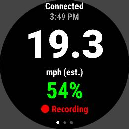
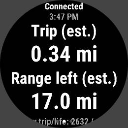
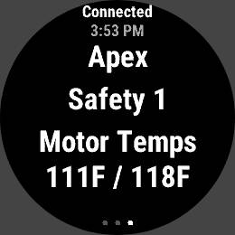
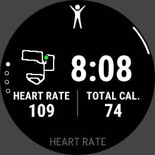

<p align="center">
  
</p>

<h1 align="center">Floatface</h1>
<p align="center"><b>Onewheel telemetry on a Garmin watch — no phone required.</b></p>

Floatface is a Connect IQ watch-app that talks directly to a Onewheel over
Bluetooth Low Energy. No companion phone app, no Onewheel app in the loop —
the watch connects to the board on its own, unlocks it, and shows live
speed, battery, riding mode, motor temps, and more, while recording a real
GPS-tracked activity with that telemetry embedded as custom FIT fields.

Built and tested against a **Garmin Forerunner 955 Solar** and a
**Onewheel GT**. It should be portable to other BLE-capable Garmin watches
and other Onewheel models with some adjustment — see [PROTOCOL.md](PROTOCOL.md)
for what's confirmed vs. assumed.

## Screenshots

<p align="center">
  
  
  
  
</p>

<p align="center"><i>Ride · Stats · Board (paged with the watch's Up/Down buttons) · the recorded activity afterward</i></p>

## Features

- **Direct BLE connection** — the watch scans for, pairs with, and unlocks
  the board itself. No phone, no FutureMotion app needed while riding.
- **Live telemetry**: speed (estimated from wheel RPM), battery %, riding
  mode, motor temperatures, board status.
- **Real activity recording** — press the watch's Start/Stop button to
  record a normal GPS-tracked FIT activity, with board telemetry attached
  as custom fields alongside it.
- **Self-calibrating range estimate** — extrapolates remaining range from
  distance covered vs. battery consumed *this ride*, not a fixed formula.
- **Halfway-battery warning** — vibrates once when battery drops to half of
  wherever it started *this ride* (not a flat 50%), so you know when to
  turn back.
- **Three pages**, paged with the physical Up/Down buttons: Ride (speed/
  battery), Stats (trip/range), Board (mode/safety/temps).

## Status

Early and personal. This is a from-scratch reverse-engineering project, not
a polished product — expect rough edges, and see the "Not yet calibrated"
list below and [PROTOCOL.md](PROTOCOL.md) for everything still uncertain.

**Confirmed against real rides:**
- Speed/trip distance (RPM-based, using GT's published 11.5" tire diameter)
  has stayed within ~2-3% of GPS-measured distance across three real rides
  (e.g. 7.42 mi estimated vs. 7.23 mi GPS) — close enough to trust as an
  estimate.
- `life_odometer` is a plain whole-mile count on GT — raw `20` matched the
  official Onewheel app's own displayed lifetime odometer (20mi), and was
  later watched climbing live in step with a ride's GPS distance too.
- `trip_amp_hours`/`trip_regen_amp_hours` are populated with real,
  live-updating data during a ride (unlike `battery_voltage`/`amperage`/
  `cell_voltages`, which read back empty) — exact unit not yet confirmed.

**Not yet calibrated / confirmed:**
- `safety_headroom`'s real meaning is unknown — it read "1" through three
  entire normal rides, so whatever we originally guessed ("safety warning")
  is probably wrong. Not shown on-screen until its meaning is known, though
  it's still recorded to the FIT file.
- `riding_mode`'s name mapping (Bay/Roam/Flow/Highline/Elevated/Apex) is
  confirmed for GT; other models/firmware may differ.
- `trip_odometer` not yet cross-checked against a known distance.

**Investigated, deliberately not implemented:**
- Switching riding modes (Bay/Roam/Flow/Highline/Elevated/Apex) from the
  watch. Three separate BLE tests couldn't confirm that writing the mode
  alone actually changes the board's ride dynamics rather than just its
  displayed name — the characteristic we hoped would prove it turned out to
  be an unrelated live value that drifts on its own, mode or no mode. Rather
  than guess at a safety-relevant BLE write, this isn't implemented. Full
  writeup in [PROTOCOL.md](PROTOCOL.md#ride-mode-switching-investigated-not-implemented-safety).

## Why no phone is needed

Connect IQ has supported direct Bluetooth Low Energy access from the watch
since API level 3.1 — the watch can scan, pair, and talk to arbitrary BLE
peripherals on its own. The hard part isn't the watch side, it's the
Onewheel side: GT-generation boards require an "unlock" write before they'll
report live telemetry, and that unlock value turns out to be computed
**server-side by FutureMotion**, tied to your account — not a fixed
algorithm we can bake into the app. See [PROTOCOL.md](PROTOCOL.md) for the
full investigation (including a detour through decompiling FutureMotion's
Android app) that led to that conclusion.

Practically, that means **you need to capture your own board's unlock
bytes once**, the same way we did. It's a one-time setup step, not
something the app can do for you automatically.

## The watch and the official Onewheel app can't both be connected at once

This isn't a bug in Floatface — it's how the board's Bluetooth firmware
works. Onewheel boards only support **one BLE connection at a time**. We
confirmed this directly: with a phone connected via the official app, the
board stops advertising entirely, so nothing else (our watch, a laptop, a
different phone) can even see it, let alone connect. Whoever connects first
holds the only slot until they disconnect.

There's no way to work around this from the outside — a BLE peripheral's
connection limit is set by its own firmware, not something a client (phone
or watch) can override. Two theoretical fixes exist, and neither is a good
idea: Connect IQ has no API for a watch to act as a BLE *peripheral*, so it
can't pretend to be the board and relay data to the phone; and doing the
reverse (a custom Android app on the phone relaying to the watch) would
mean writing and maintaining a whole separate phone app, reintroducing
exactly the phone dependency this project exists to avoid.

**In practice**: use one or the other. Turn off your phone's Bluetooth (or
background/force-quit the Onewheel app) before opening Floatface, and
vice versa when you need something only the official app currently
provides. If Floatface can't find your board within 30 seconds, it'll show
a hint suggesting this is probably why.

## Capturing your board's unlock bytes

You need this before the app will do anything beyond scan for your board.
It works by watching FutureMotion's own official Onewheel app unlock your
board over Bluetooth, and copying the bytes it sends.

### Option A: Android phone + adb (confirmed working)

1. On your phone: **Settings → About phone**, tap "Build number" 7 times to
   enable Developer Options.
2. **Settings → System → Developer options**, enable both **USB debugging**
   and **Bluetooth HCI snoop log**.
3. Toggle Bluetooth off and back on (clean start to the log).
4. Plug the phone into your computer via USB and approve the "Allow USB
   debugging" prompt.
5. Open the official Onewheel app and let it connect normally to your
   board — this performs the real unlock. (Bonus: if you also change riding
   modes in the app while connected, you'll capture that too, useful for
   confirming the mode-name mapping on your own board.)
6. Pull the log via a full bug report (modern Android won't let you read it
   directly without root):
   ```bash
   adb devices
   adb bugreport bugreport.zip
   unzip -l bugreport.zip | grep btsnoop   # path varies by Android version
   unzip -p bugreport.zip 'FS/data/log/bt/btsnoop_hci.log' > btsnoop_hci.log
   ```
7. Set up the Python tooling and parse it:
   ```bash
   cd tools/ow_spike
   python3 -m venv .venv
   ./.venv/bin/pip install -r requirements.txt
   ./.venv/bin/python btsnoop_parse.py btsnoop_hci.log --address AA:BB:CC:DD:EE:FF
   ```
   (use your board's actual BLE address — `unlock.py --scan-all` will show
   it to you if you don't know it)
8. Look for a `WRITE_REQ` to the `uart_serial_write` characteristic
   (`e659f3ff-...`) with a 20-byte value shaped like
   `<3 bytes><16 bytes><1 byte>`. Those 20 bytes are your unlock value.
9. Copy `garmin-app/source/LocalConfig.mc.example` to
   `garmin-app/source/LocalConfig.mc` and paste your bytes in.

### Option B: external BLE sniffer dongle (untested)

A standalone BLE radio sniffer — e.g. a Nordic nRF52840 USB dongle (~$15)
flashed with Nordic's free "nRF Sniffer for Bluetooth LE" firmware — can
passively capture the same handshake over the air, directly between your
phone and the board, without touching the phone's OS at all. That would
work regardless of phone OS (including iOS, which has no accessible
equivalent to Android's HCI snoop log), since it's listening to radio
waves, not reading phone logs.

This is plausible because our own BLE connection to the board never
triggered any OS-level pairing/encryption — suggesting the link isn't
encrypted at the radio layer, so a passive sniffer should see the same
plaintext bytes Option A captures. **Not yet tested against real
hardware** — if you try it, we'd love to know if it works.

## Building and installing

1. Install the [Connect IQ SDK](https://developer.garmin.com/connect-iq/sdk/)
   (the CLI-based [connect-iq-sdk-manager-cli](https://github.com/lindell/connect-iq-sdk-manager-cli)
   works well on Linux).
2. Generate a developer signing key:
   ```bash
   cd garmin-app
   openssl genrsa -out developer_key.pem 4096
   openssl pkcs8 -topk8 -inform PEM -outform DER -in developer_key.pem -out developer_key.der -nocrypt
   ```
3. Set up your unlock bytes (see above) in `garmin-app/source/LocalConfig.mc`.
4. Build:
   ```bash
   monkeyc -d fr955 -f monkey.jungle -o bin/floatface.prg -y developer_key.der
   ```
5. Connect your watch via USB (it'll appear as an MTP device on most
   systems, not a plain USB drive) and copy `bin/floatface.prg` into the
   `GARMIN/Apps/` folder on the watch. The file will disappear from view
   after the watch ingests it on next reconnect — that's expected.
6. Eject, disconnect, and open "Floatface" from the watch's app list.

## Project layout

```
garmin-app/           Connect IQ (Monkey C) watch-app source
tools/ow_spike/        Python BLE spike scripts used to reverse-engineer
                       and validate the protocol before writing Monkey C
PROTOCOL.md            Everything confirmed (and still open) about the
                       Onewheel BLE protocol
docs/boards/           What's known/unknown per Onewheel model (only GT is
                       fully confirmed) -- see CONTRIBUTING.md to help fill
                       in another model
```

## Other Onewheel models

Floatface only has real hardware to test against a GT. The BLE protocol is
confirmed shared across generations, but tire diameter and riding mode
names/numbers are model-specific and mostly unconfirmed for anything else --
see [docs/boards/](docs/boards/) for what's known per model, and
[CONTRIBUTING.md](CONTRIBUTING.md) if you'd like to help establish the rest
for a Pint, XR, or other board using the same GPS-cross-check and live-testing
methodology this project has used throughout.

## Acknowledgments

- [kite247/Onewheel2Garmin](https://github.com/kite247/Onewheel2Garmin) — an
  earlier, differently-architected attempt (phone-app notification
  bridging rather than direct BLE) that was useful prior art.
- [TomasHubelbauer/onewheel-web-bluetooth](https://github.com/TomasHubelbauer/onewheel-web-bluetooth) —
  reverse-engineered the pre-GT Onewheel BLE protocol and characteristic
  map that this project's investigation started from.

## Disclaimer

Not affiliated with Future Motion, Inc. (Onewheel) or Garmin Ltd. Onewheel
is a trademark of Future Motion, Inc. This is a personal reverse-engineering
project, provided as-is with no warranty. A Onewheel is a self-balancing
personal transporter — use this app at your own risk, and don't let a watch
screen distract you from actually riding safely.
